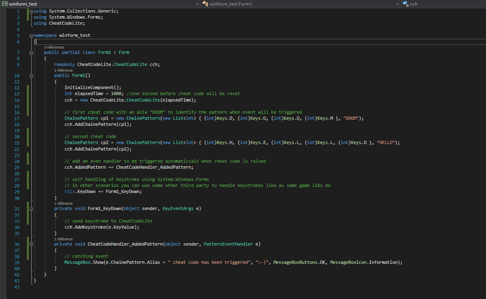
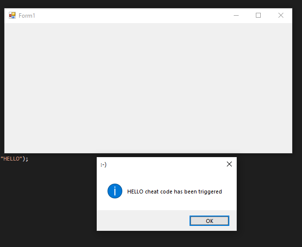
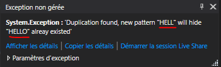
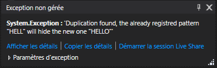
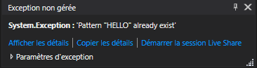

# CheatCodeLite
Cheat code keystrokes 

 

Hello, this is a library that allow you to trigger some cheat codes in your game/application. 
The keystrokes handler is not included in this library cause it really depend on the context where this library is used, most of time games use a third party to catch keystrokes not the one in the .Net Framework Class Library. 

Just add a reference to the library in the release https://github.com/melharfi/CheatCodeLite/releases
or using nuget

Once it's done you can then use this code to start :

 
 

Pay attention that the value passed to the CheatCodeLite.CheatCodeLite(int keystrokesInterval) is the time allowed to keep chained cheat code, if this time is overwhelmed then the cheat code in progress is reseted. 
To desable this timer just put a very long value like 100000000 :) 

Pay attention to some scenarios that will raise some error.
When a cheat code is registred like "HELLO" in the first hand, and another cheat code is registred like "HELL", in that case the second cheat code will hide the first one because cheat code will be reset as soon as it trigger the "HELL" event, so to avoid that an exception will be thrown to prevent and warn you about that.
 

Same scenarion when the revers happen, when you first add a cheat code like "HELL" and that you just another one like "HELLO", then the second one will be hidden by the first one.
 

Same thing when a duplication is found. 
 

Hope it helps someone
